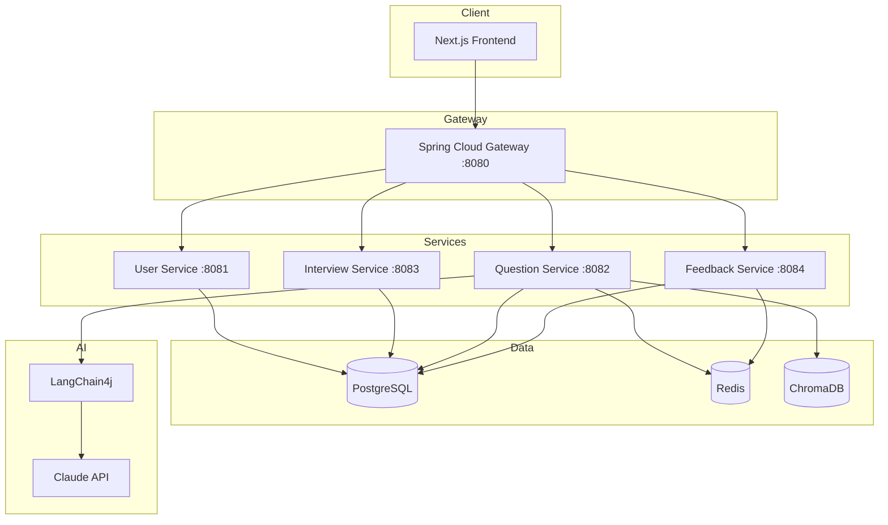
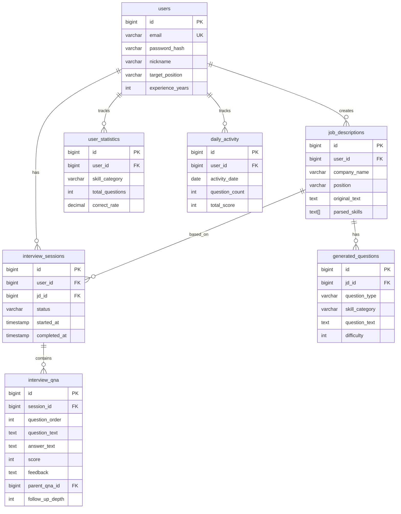

# AI Interview Coach

> JD 기반 맞춤 질문 생성 + AI 모의 면접 + 실시간 피드백 시스템

채용공고(JD)를 분석하여 예상 면접 질문을 생성하고, AI 면접관과 실시간 모의 면접을 진행하며, 답변에 대한 즉각적인 피드백을 제공하는 서비스입니다.

## 주요 기능

| 기능 | 설명 |
|------|------|
| **JD 분석** | 채용공고 텍스트 → 핵심 역량, 기술 스택 자동 추출 |
| **질문 생성** | JD + 직무 유형 기반 맞춤 면접 질문 생성 (RAG로 중복 방지) |
| **모의 면접** | AI 면접관과 실시간 대화형 면접 (타이머, 일시정지/재개) |
| **실시간 피드백** | STAR 기법, 기술 정확도, 개선점 분석 (SSE 스트리밍) |
| **꼬리 질문** | 답변 부족 시 자동 꼬리 질문 생성 (최대 2단계) |
| **학습 통계** | 카테고리별 정답률, 취약 분야 추적, 일일 활동 그래프 |
| **취약 분야 우선** | 70% 미만 카테고리 감지 → 질문 생성 시 우선 반영 |

## 스크린샷

<details>
<summary><b>대시보드</b> (클릭하여 확대)</summary>

</details>

<details>
<summary><b>JD 분석</b> (클릭하여 확대)</summary>

</details>

<details>
<summary><b>면접 진행</b> (클릭하여 확대)</summary>

</details>

<details>
<summary><b>AI 피드백</b> (클릭하여 확대)</summary>

</details>

<details>
<summary><b>면접 결과 리포트</b> (클릭하여 확대)</summary>

</details>

<details>
<summary><b>학습 통계</b> (클릭하여 확대)</summary>

</details>

## 아키텍처



## 기술 스택

| 영역 | 기술 |
|------|------|
| **Backend** | Java 21, Spring Boot 3.2, Spring Security + JWT, Spring Data JPA, Spring Cloud Gateway |
| **AI/LLM** | LangChain4j, Claude API (Primary), OpenAI (Fallback), AllMiniLmL6V2 (임베딩) |
| **Database** | PostgreSQL 16, Redis 7 (캐싱), ChromaDB (벡터 DB / RAG) |
| **Frontend** | Next.js 14 (App Router), TypeScript, Tailwind CSS, Zustand, React Query, sonner |
| **Testing** | JUnit 5 + Mockito (백엔드), Vitest + Testing Library (프론트엔드), k6 (성능) |
| **Infra** | Docker Compose, Kubernetes (Kustomize), GitHub Actions CI/CD |
| **Monitoring** | Prometheus, Grafana, InfluxDB |

## 시작하기

### 요구사항

- Java 21+
- Docker & Docker Compose
- Claude API Key (선택 - 없으면 Mock 모드)

### Docker Compose (권장)

```bash
cd infra/docker
cp .env.example .env    # API 키 설정 (선택)
docker-compose up -d --build

# 프론트엔드: http://localhost:3000
# API Gateway: http://localhost:8080
```

### 개발 모드

```bash
# 1. 인프라
cd infra/docker && docker-compose up -d postgres redis chromadb

# 2. 백엔드
cd backend && ./gradlew build
./gradlew :gateway:bootRun           # :8080
./gradlew :user-service:bootRun      # :8081
./gradlew :question-service:bootRun  # :8082
./gradlew :interview-service:bootRun # :8083
./gradlew :feedback-service:bootRun  # :8084

# 3. 프론트엔드
cd frontend/web && npm install && npm run dev  # :3000
```

### 테스트

```bash
cd backend && ./gradlew test                  # 백엔드 전체
cd backend && ./gradlew :question-service:test # 서비스 단위

cd frontend/web && npm test                   # 프론트엔드 (watch)
cd frontend/web && npm run test:run           # 프론트엔드 (단일 실행)
```

## 프로젝트 구조

```
interview-coach/
├── backend/
│   ├── gateway/              # API Gateway, JWT 검증, 라우팅
│   ├── user-service/         # 회원가입/로그인, JWT 발급
│   ├── question-service/     # JD 분석, 질문 생성, RAG, Redis 캐싱
│   ├── interview-service/    # 면접 세션, 검색, 일시정지/재개
│   └── feedback-service/     # 답변 평가, SSE 스트리밍, 통계
├── frontend/web/             # Next.js 14 App Router
│   └── src/
│       ├── app/(auth)/       # 로그인, 회원가입
│       ├── app/(main)/       # 대시보드, JD, 면접, 기록, 통계, 프로필
│       ├── components/       # 재사용 컴포넌트 (Neo-brutalist UI)
│       ├── lib/              # API 클라이언트, 유틸리티
│       └── stores/           # Zustand 상태 관리
├── infra/
│   ├── docker/               # Docker Compose
│   └── k8s/                  # Kubernetes (Kustomize base + dev/prod)
└── performance/              # k6 시나리오, Grafana 대시보드
```

각 백엔드 서비스는 Clean Architecture를 따릅니다:

```
service/
├── domain/          # 엔티티, 도메인 로직
├── application/     # 유스케이스, 서비스
├── infrastructure/  # JPA, 외부 API 클라이언트
└── presentation/    # REST Controller, DTO
```

## API 엔드포인트

> 각 서비스 실행 후 Swagger UI에서 상세 명세를 확인할 수 있습니다.

| 서비스 | 주요 엔드포인트 | 비고 |
|--------|----------------|------|
| **user-service** | `POST /api/v1/auth/signup`, `login`, `refresh` | JWT 발급/갱신 |
| | `GET /api/v1/users/me`, `PUT /api/v1/users/me` | 프로필 조회/수정 |
| **question-service** | `POST /api/v1/jd`, `GET /api/v1/jd` | JD 등록/조회 (Redis 캐싱) |
| | `POST /api/v1/jd/{id}/analyze` | JD 스킬 분석 |
| | `POST /api/v1/questions/generate` | 면접 질문 생성 (RAG) |
| | `GET /api/v1/questions/similar` | 유사 질문 검색 |
| **interview-service** | `POST /api/v1/interviews` | 면접 세션 시작 |
| | `POST /api/v1/interviews/{id}/answer` | 답변 제출 |
| | `POST /api/v1/interviews/{id}/follow-up` | 꼬리 질문 답변 |
| | `PATCH /api/v1/interviews/{id}/pause`, `resume` | 일시정지/재개 |
| | `GET /api/v1/interviews/search?keyword=` | 면접 기록 검색 |
| **feedback-service** | `GET /api/v1/feedback/session/{id}/stream` | SSE 피드백 스트림 |
| | `GET /api/v1/statistics` | 학습 통계 조회 |

## 데이터 모델



## 성능 최적화

| 항목 | 기법 | 효과 |
|------|------|------|
| N+1 쿼리 | `LEFT JOIN FETCH` | 11 SQL → 1 SQL |
| DB 인덱스 | 7개 복합/GIN 인덱스 | Full Scan → Index Scan |
| Race Condition | `@Lock(PESSIMISTIC_WRITE)` | 데이터 정합성 보장 |
| Redis 캐싱 | `@Cacheable` (TTL 5분) | DB 쿼리 90% 감소 |
| SSE 안정화 | 전용 스레드 풀 + TTL 정리 | 타임아웃/메모리 누수 해결 |
| JVM 튜닝 | ZGC + 서비스별 힙 사이징 | GC Pause 2s → 5ms |
| 프론트엔드 | React Query 캐싱 | API 요청 70% 감소 |
| 임베딩 | `embedAll()` 배치 처리 | 2.0s → 0.4s |
| 토큰 갱신 | Mutex 패턴 (failedQueue) | 동시 갱신 Race Condition 해결 |
| 입력 검증 | `@Validated` + ConstraintViolation 핸들러 | 잘못된 입력 컨트롤러 단 차단 |

상세: [docs/performance/TUNING.md](docs/performance/TUNING.md)

## 기술적 도전과 해결

### LLM / AI

| 도전 | 해결 |
|------|------|
| JD에서 핵심 정보 추출 | 프롬프트 엔지니어링 + JSON 구조화 출력 |
| 질문 중복 방지 | RAG (ChromaDB + 로컬 임베딩, 배치 처리) |
| LLM 비용 최적화 | Mock 모드 지원 + Redis 캐싱 |
| 꼬리 질문 무한 루프 | 최대 깊이 2 + 점수 85점 이상 시 중단 |

### 백엔드 성능

| 도전 | 해결 |
|------|------|
| N+1 쿼리 (11 SQL) | `@Query` + `LEFT JOIN FETCH` |
| 동시 통계 업데이트 Lost Update | `@Lock(PESSIMISTIC_WRITE)` 비관적 락 |
| SSE 스레드 고갈 (ForkJoinPool 8개) | 전용 `ThreadPoolTaskExecutor` (core:50, max:100) |
| SseEmitter 메모리 누수 | `@Scheduled` TTL 정리 + max 5,000 제한 |
| JVM Full GC 스파이크 (2초) | ZGC + 서비스별 힙 사이징 |

### 프론트엔드

| 도전 | 해결 |
|------|------|
| 새로고침 시 로그아웃 | Zustand hydration 상태 추적 |
| 동시 토큰 갱신 Race Condition | Mutex 패턴 (isRefreshing + failedQueue) |
| 컨테이너 시간대 불일치 | UTC → KST 변환 유틸리티 |
| SVG 원형 게이지 동적 색상 | Tailwind 클래스 대신 인라인 스타일 |

## 개발 로드맵

| Phase | 내용 | 상태 |
|-------|------|------|
| **1. MVP 백엔드** | JWT 인증, JD 분석, 질문 생성 (LLM), 모의 면접, SSE 피드백, 통계, API Gateway | Done |
| **2. 프론트엔드** | Next.js 14 UI, 면접 화면, 통계 대시보드, 기록/프로필 페이지 | Done |
| **3. 테스트 & 안정화** | JUnit 5 단위 테스트, SSE 안정화, 버그 수정 | Done |
| **4. 고도화** | RAG (ChromaDB), Docker Compose 통합, 꼬리 질문, 취약 분야 우선, 일일 활동 | Done |
| **5. 성능 최적화** | Fetch Join, 인덱스, 비관적 락, Redis 캐싱, ZGC, React Query, k6 시나리오 | Done |
| **6. 배포 인프라** | GitHub Actions CI/CD, Kubernetes (Kustomize), HPA, Network Policy | Done |
| **7. UX & 품질** | Toast 알림, 스켈레톤 로딩, 입력 검증, 토큰 갱신 수정, React Query 표준화, 프론트엔드 테스트 | Done |

## 라이선스

MIT License
