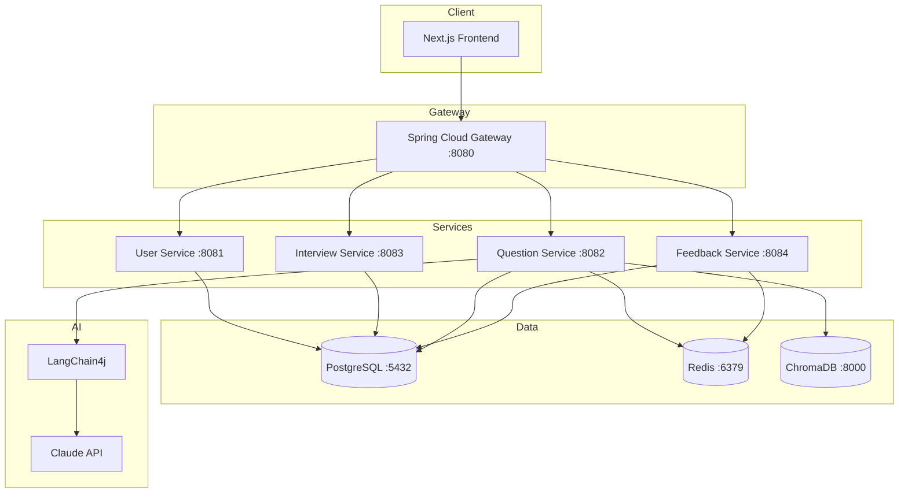
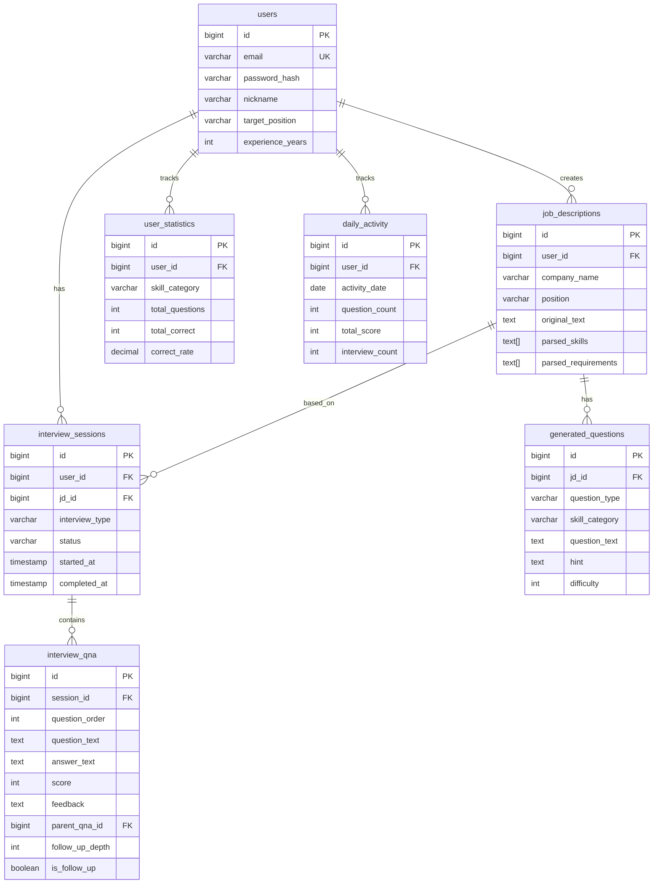

# AI 면접 코치 (Interview Coach)

JD 기반 맞춤 질문 생성 + AI 모의 면접 + 실시간 피드백 시스템

## 프로젝트 소개

취업 준비생을 위한 AI 면접 코칭 서비스입니다. 채용공고(JD)를 분석하여 예상 질문을 생성하고, AI 면접관과 모의 면접을 진행하며, 답변에 대한 즉각적인 피드백을 제공합니다.

### 왜 만들었나?

- 면접 준비 시 "어떤 질문이 나올지" 예측하기 어려움
- 혼자 연습하면 객관적인 피드백을 받기 힘듦
- 기술 면접 질문에 대한 체계적인 학습 필요

## 주요 기능

| 기능 | 설명 |
|------|------|
| **JD 분석** | 채용공고 URL/텍스트 → 핵심 역량, 기술 스택 자동 추출 |
| **질문 생성** | JD + 직무 유형 기반 맞춤 면접 질문 생성 (LLM) |
| **모의 면접** | AI 면접관과 실시간 대화형 면접 진행 |
| **답변 피드백** | STAR 기법, 기술 정확도, 개선점 분석 (SSE 스트리밍) |
| **꼬리 질문** | 답변 부족 시 자동 꼬리 질문 생성 (최대 2단계 깊이) |
| **면접 기록** | 과거 면접 이력 조회, 키워드 검색, 상세 리포트 확인 |
| **면접 일시정지/재개** | 면접 중단 후 나중에 이어서 진행 |
| **면접 타이머** | 질문당 3분/5분 카운트다운, 시간 초과 경고 |
| **모범 답안** | 피드백 후 모범 답안 토글 표시 |
| **학습 통계** | 취약 분야 추적, 카테고리별 정답률, 성장 추이 |
| **취약 분야 우선** | 70% 미만 카테고리 자동 감지, 질문 생성 시 우선 반영 |
| **일일 활동 기록** | 매일 답변 횟수/점수 추적, 주간 활동 그래프 |

## 아키텍처



## 기술 스택

### Backend
- Java 21
- Spring Boot 3.2
- Spring Security + JWT
- Spring Data JPA
- Spring Cloud Gateway
- LangChain4j

### Database
- PostgreSQL 16 - 메인 데이터
- Redis 7 - 세션, 캐싱
- ChromaDB - 벡터 임베딩 저장 (RAG)

### AI/LLM
- Claude API (claude-sonnet-4-20250514) - Primary
- OpenAI API (Fallback 구성 가능)
- AllMiniLmL6V2 - 로컬 임베딩 모델 (RAG)

### Frontend
- Next.js 14 (App Router)
- TypeScript
- Tailwind CSS
- Zustand (상태 관리)
- React Query (서버 상태 캐싱)
- Framer Motion (애니메이션)

### Infra & DevOps
- Docker / Docker Compose
- GitHub Actions (CI/CD)
- k6 (성능 테스트)
- Prometheus + Grafana + InfluxDB (모니터링)

## 서비스 구조

| 서비스 | 포트 | 역할 |
|--------|------|------|
| gateway | 8080 | API Gateway, JWT 검증, 라우팅 |
| user-service | 8081 | 회원가입/로그인, JWT 발급 |
| question-service | 8082 | JD 분석, 질문 생성 (LLM), Redis 캐싱 |
| interview-service | 8083 | 모의 면접 세션 관리, 검색, 일시정지/재개 |
| feedback-service | 8084 | 답변 평가, SSE 피드백, 통계, 비관적 락 |

## 프로젝트 구조

```
interview-coach/
├── backend/
│   ├── gateway/              # API Gateway
│   ├── user-service/         # 회원 관리, JWT 인증
│   ├── question-service/     # JD 분석, 질문 생성 (LangChain4j)
│   ├── interview-service/    # 면접 세션 관리
│   └── feedback-service/     # 답변 평가, SSE 스트리밍, 통계
├── frontend/web/
│   └── src/app/
│       ├── (auth)/           # 로그인, 회원가입
│       └── (main)/
│           ├── dashboard/    # 대시보드
│           ├── jd/           # JD 관리
│           ├── interview/    # 면접 진행
│           ├── history/      # 면접 기록
│           ├── statistics/   # 학습 통계
│           └── profile/      # 프로필
├── infra/
│   └── docker/               # Docker Compose 설정
├── performance/
│   ├── k6/                   # 성능 테스트 시나리오
│   ├── monitoring/           # Grafana, Prometheus, InfluxDB
│   └── scripts/              # 테스트 실행 스크립트
└── docs/
    └── performance/          # 성능 테스트 문서
```

## 시작하기

### 요구사항

- Java 21+
- Docker & Docker Compose
- (선택) Claude API Key

### 환경 변수

```bash
# .env (선택 - 없으면 Mock 모드로 동작)
CLAUDE_API_KEY=your-api-key
```

### 실행 (Docker Compose - 권장)

```bash
# 전체 스택 한 번에 실행 (인프라 + 백엔드 + 프론트엔드)
cd infra/docker
cp .env.example .env  # API 키 설정 (선택)
docker-compose up -d --build

# 접속
# - 프론트엔드: http://localhost:3000
# - API Gateway: http://localhost:8080
```

### 실행 (개발 모드)

```bash
# 1. 인프라만 실행 (PostgreSQL, Redis, ChromaDB)
cd infra/docker && docker-compose up -d postgres redis chromadb

# 2. 백엔드 빌드 및 실행
cd backend && ./gradlew build

./gradlew :gateway:bootRun           # 포트 8080
./gradlew :user-service:bootRun      # 포트 8081
./gradlew :question-service:bootRun  # 포트 8082
./gradlew :interview-service:bootRun # 포트 8083
./gradlew :feedback-service:bootRun  # 포트 8084

# 3. 프론트엔드 실행
cd frontend/web && npm install && npm run dev  # 포트 3000
```

### 테스트

```bash
# 백엔드 단위 테스트
cd backend && ./gradlew test

# 특정 서비스 테스트
./gradlew :question-service:test
./gradlew :feedback-service:test
./gradlew :interview-service:test
```

## API 명세

### 인증 API (user-service)

```http
# 회원가입
POST /api/v1/auth/signup
Content-Type: application/json

{
  "email": "user@example.com",
  "password": "password123",
  "nickname": "닉네임"
}

# 로그인
POST /api/v1/auth/login
Content-Type: application/json

{
  "email": "user@example.com",
  "password": "password123"
}

# Response
{
  "accessToken": "eyJhbGc...",
  "refreshToken": "eyJhbGc...",
  "tokenType": "Bearer",
  "expiresIn": 3600
}
```

### JD 분석 API (question-service)

```http
# JD 등록
POST /api/v1/jd
X-User-Id: 1
Content-Type: application/json

{
  "companyName": "카카오",
  "position": "백엔드 개발자",
  "originalText": "Java, Spring Boot 경력 3년 이상..."
}

# JD 분석
POST /api/v1/jd/{id}/analyze

# Response
{
  "jdId": 1,
  "skills": ["Java", "Spring Boot", "JPA"],
  "requirements": ["3년 이상 경력", "MSA 경험"],
  "summary": "백엔드 개발자 포지션..."
}

# 질문 생성
POST /api/v1/questions/generate
X-User-Id: 1
Content-Type: application/json

{
  "jdId": 1,
  "questionType": "mixed",
  "count": 5,
  "difficulty": 3
}
```

### 면접 API (interview-service)

```http
# 면접 시작
POST /api/v1/interviews
X-User-Id: 1
Content-Type: application/json

{
  "jdId": 1,
  "questionIds": [1, 2, 3],
  "interviewType": "PRACTICE"
}

# 답변 제출
POST /api/v1/interviews/{id}/answer
Content-Type: application/json

{
  "qnaId": 1,
  "answer": "저는 SAGA 패턴을 사용해서..."
}

# 면접 기록 검색
GET /api/v1/interviews/search?keyword=Spring

# 면접 일시정지
PATCH /api/v1/interviews/{id}/pause

# 면접 재개
PATCH /api/v1/interviews/{id}/resume

# 면접 완료
POST /api/v1/interviews/{id}/complete
```

### 피드백 API (feedback-service)

```http
# SSE 피드백 스트림
GET /api/v1/feedback/session/{sessionId}/stream

# 통계 조회
GET /api/v1/statistics
X-User-Id: 1

# Response
{
  "userId": 1,
  "totalQuestions": 50,
  "totalCorrect": 35,
  "overallCorrectRate": 70.0,
  "byCategory": [
    {"category": "Java", "totalQuestions": 20, "correctRate": 80.0}
  ]
}
```

## 성능 최적화

10가지 성능 최적화를 적용하여 각각 **문제 상황 → 원인 분석 → 해결 → 측정** 구조로 기록했습니다.

| # | 항목 | 기법 | 효과 |
|---|------|------|------|
| 1 | N+1 쿼리 | `LEFT JOIN FETCH` | 11 SQL → 1 SQL |
| 2 | DB 인덱스 | 7개 복합/GIN 인덱스 | Full Scan → Index Scan |
| 3 | Race Condition | `@Lock(PESSIMISTIC_WRITE)` | 데이터 정합성 100% |
| 4 | Redis 캐싱 | `@Cacheable` (TTL 5분) | DB 쿼리 90% 감소 |
| 5 | SSE 스레드 풀 | 전용 `ThreadPoolTaskExecutor` | 타임아웃 50% → 0% |
| 6 | SSE 메모리 누수 | TTL 정리 + max 5,000 | 힙 안정화 |
| 7 | JVM/GC | ZGC + 서비스별 힙 사이징 | GC Pause 2s → 5ms |
| 8 | HikariCP | 서비스별 풀 차등 할당 | Connection Wait 감소 |
| 9 | 프론트엔드 | React Query 캐싱 | API 요청 70% 감소 |
| 10 | 임베딩 | `embedAll()` 배치 | 2.0s → 0.4s |

상세 기록: [docs/performance/TUNING.md](docs/performance/TUNING.md)

## 성능 테스트

```bash
# 모니터링 스택 실행
cd performance/monitoring
docker-compose -f docker-compose.monitoring.yml up -d

# Smoke Test (기본 동작 확인)
./performance/scripts/run-smoke.sh

# Load Test (부하 테스트)
./performance/scripts/run-load.sh -t load

# k6 시나리오별 실행
k6 run performance/k6/scenarios/search-load-test.js       # 검색 API 부하
k6 run performance/k6/scenarios/concurrent-answer-test.js  # Race condition 검증
k6 run performance/k6/scenarios/soak-test.js               # 장시간 메모리/GC 테스트

# 결과 리포트 생성
./performance/scripts/generate-report.sh
```

**대시보드:**
- Grafana: http://localhost:3000 (admin/admin)
- Prometheus: http://localhost:9090
- InfluxDB: http://localhost:8086

## 데이터 모델



## 개발 로드맵

- [x] 프로젝트 설계
- [x] **Phase 1: MVP 백엔드**
  - [x] 회원가입/로그인 (JWT)
  - [x] JD 텍스트 분석 → 질문 생성 (LLM)
  - [x] 모의 면접 세션 관리
  - [x] SSE 피드백 스트리밍
  - [x] 학습 통계
  - [x] API Gateway
  - [x] 성능 테스트 인프라 (k6, Grafana)
- [x] **Phase 2: 프론트엔드**
  - [x] Next.js 14 UI 구현
  - [x] 면접 진행 화면 (실시간 피드백)
  - [x] 통계 대시보드 (카테고리별 점수, 성장 추이)
  - [x] 면접 기록 페이지 (히스토리, 상세 리포트)
  - [x] 프로필 페이지
- [x] **Phase 3: 테스트 & 안정화**
  - [x] 단위 테스트 (JUnit 5, Mockito)
  - [x] SSE 스트리밍 안정화
  - [x] 버그 수정 및 UX 개선
- [x] **Phase 4: 고도화**
  - [x] RAG 파이프라인 (ChromaDB + LangChain4j)
  - [x] Docker Compose 전체 스택 (한 번에 실행)
  - [x] 꼬리 질문 기능 (점수 기반 자동 생성, 최대 2단계)
  - [x] 취약 분야 우선 반영 (70% 미만 카테고리 자동 감지 → 질문 생성 시 60% 비중)
  - [x] 일일 활동 기록 (주간 활동 그래프, 실제 DB 데이터 기반)
- [x] **Phase 5: 성능 최적화**
  - [x] N+1 쿼리 → Fetch Join
  - [x] 복합/GIN 인덱스 7개 추가
  - [x] Race Condition → 비관적 락
  - [x] Redis 캐싱 (`@Cacheable`)
  - [x] SSE 스레드 풀 격리 + 메모리 누수 해결
  - [x] JVM ZGC 튜닝 + HikariCP 풀 사이징
  - [x] React Query 프론트엔드 캐싱
  - [x] 임베딩 배치 처리
  - [x] 면접 검색, 일시정지/재개, 타이머, 모범답안 기능
  - [x] k6 시나리오 3종 (검색, 동시성, Soak Test)
  - [x] Prometheus 메트릭 (JVM, Hibernate, HikariCP)
- [ ] **Phase 6: 배포**
  - [ ] Kubernetes 배포
  - [ ] CI/CD 파이프라인 완성

## 기술적 도전

| 도전 | 해결 방법 |
|------|----------|
| JD에서 핵심 정보 추출 | LLM 프롬프트 엔지니어링 + JSON 구조화 출력 |
| 실시간 피드백 | SSE (Server-Sent Events) 스트리밍 |
| 마이크로서비스 인증 | Gateway에서 JWT 검증 → X-User-Id 헤더 전달 |
| LLM 비용 최적화 | Mock 모드 지원, Redis 캐싱 (`@Cacheable` TTL 5분) |
| 성능 측정 | k6 + InfluxDB + Grafana + Prometheus 대시보드 |
| 질문 중복 방지 | RAG (ChromaDB + 로컬 임베딩 모델) |
| 컨테이너 시간대 | UTC 날짜 파싱 유틸리티로 KST 변환 |
| 새로고침 로그아웃 | Zustand hydration 상태 추적 |
| 꼬리 질문 무한 루프 방지 | 최대 깊이 2 + 점수 85점 이상 시 중단 |
| 꼬리 질문 후 원본 복귀 | 프론트엔드에서 returnToQuestionIndex 상태 관리 |
| 취약 분야 우선 반영 | 통계 API에서 70% 미만 카테고리 추출 → LLM 프롬프트에 60% 비중 지시 |
| SVG 원형 게이지 색상 | Tailwind 클래스 대신 인라인 스타일로 동적 색상 적용 |
| N+1 쿼리 (11 SQL → 1) | `@Query` + `LEFT JOIN FETCH`로 Eager Loading |
| 동시 통계 업데이트 Lost Update | `@Lock(PESSIMISTIC_WRITE)` 비관적 락 |
| SSE 스레드 고갈 (ForkJoinPool 8개) | 전용 `ThreadPoolTaskExecutor` (core:50, max:100) |
| SseEmitter 메모리 누수 | `@Scheduled` TTL 정리 + max 5,000 제한 |
| JVM Full GC 스파이크 (2초) | ZGC + 서비스별 힙 사이징 (`-XX:+UseZGC`) |
| HikariCP 커넥션 부족 | 서비스별 풀 차등 할당 (10~20) |
| 프론트엔드 API 중복 호출 | React Query `staleTime` + 캐싱 |
| 임베딩 순차 처리 (20개 = 2초) | `embedAll()` 배치 API (0.4초) |

## 라이선스

MIT License
