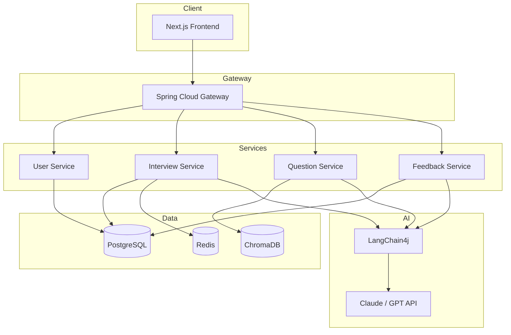
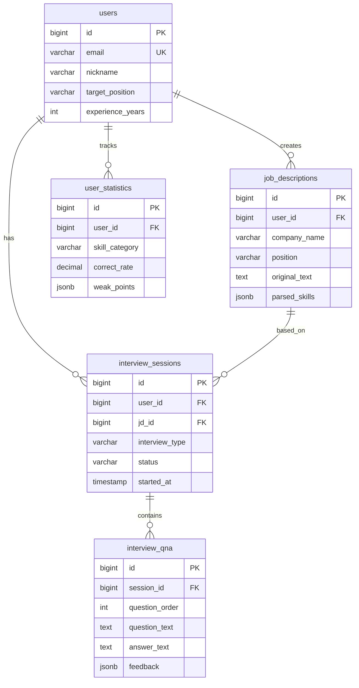

# AI 면접 코치 (Interview Coach)

JD 기반 맞춤 질문 생성 + AI 모의 면접 + 실시간 피드백 시스템

## 프로젝트 소개

취업 준비생을 위한 AI 면접 코칭 서비스입니다. 채용공고(JD)를 분석하여 예상 질문을 생성하고, AI 면접관과 모의 면접을 진행하며, 답변에 대한 즉각적인 피드백을 제공합니다.

### 왜 만들었나?

- 면접 준비 시 "어떤 질문이 나올지" 예측하기 어려움
- 혼자 연습하면 객관적인 피드백을 받기 힘듦
- 기술 면접 질문에 대한 체계적인 학습 필요

## 주요 기능

| 기능 | 설명 |
|------|------|
| **JD 분석** | 채용공고 URL/텍스트 → 핵심 역량, 기술 스택 자동 추출 |
| **질문 생성** | JD + 직무 유형 기반 맞춤 면접 질문 생성 (RAG) |
| **모의 면접** | AI 면접관과 실시간 대화, 꼬리 질문 지원 |
| **답변 피드백** | STAR 기법, 기술 정확도, 개선점 분석 |
| **학습 통계** | 취약 분야 추적, 성장 그래프 |

## 아키텍처



## 기술 스택

### Backend
- Java 21
- Spring Boot 3
- Spring Security + JWT
- Spring Data JPA
- LangChain4j

### Database
- PostgreSQL - 메인 데이터
- Redis - 세션, 대화 컨텍스트 캐싱
- ChromaDB - 벡터 임베딩 저장

### AI/LLM
- Claude API (Primary)
- OpenAI API (Fallback)
- text-embedding-3-small (임베딩)

### Frontend
- Next.js 14
- TypeScript
- Tailwind CSS

### Infra
- Docker / Docker Compose
- GitHub Actions (CI/CD)
- Prometheus + Grafana (모니터링)

## 프로젝트 구조

```
interview-coach/
├── backend/
│   ├── gateway/              # API Gateway
│   ├── user-service/         # 회원 관리
│   ├── interview-service/    # 면접 세션 관리
│   ├── question-service/     # JD 분석, 질문 생성 (RAG)
│   └── feedback-service/     # 답변 평가, 통계
├── frontend/
│   └── web/                  # Next.js 클라이언트
├── infra/
│   ├── docker/
│   └── k8s/
└── docs/
    ├── api/
    └── architecture/
```

## 시작하기

### 요구사항

- Java 21+
- Node.js 18+
- Docker & Docker Compose
- Claude API Key 또는 OpenAI API Key

### 환경 변수

```bash
# .env
CLAUDE_API_KEY=your-api-key
OPENAI_API_KEY=your-api-key
DATABASE_URL=jdbc:postgresql://localhost:5432/interview_coach
REDIS_HOST=localhost
CHROMA_HOST=localhost
JWT_SECRET=your-jwt-secret
```

### 실행

```bash
# 인프라 실행
docker-compose up -d

# 백엔드 실행
cd backend
./gradlew bootRun

# 프론트엔드 실행
cd frontend/web
npm install
npm run dev
```

## API 명세

### JD 분석

```http
POST /api/jd/analyze
Content-Type: application/json

{
  "url": "https://example.com/job-posting"
}
```

**Response**
```json
{
  "id": 1,
  "company": "카카오",
  "position": "백엔드 개발자",
  "skills": ["Java", "Spring", "Kubernetes"],
  "requirements": ["MSA 경험", "대용량 트래픽 처리"],
  "generatedQuestions": [
    {
      "type": "technical",
      "question": "MSA 환경에서 분산 트랜잭션을 어떻게 처리하셨나요?"
    }
  ]
}
```

### 모의 면접

```http
POST /api/interview/start
Content-Type: application/json

{
  "jdId": 1,
  "type": "technical"
}
```

```http
POST /api/interview/{sessionId}/answer
Content-Type: application/json

{
  "answer": "저는 SAGA 패턴을 사용해서..."
}
```

**Response (SSE Stream)**
```
data: {"type": "feedback", "content": "기술적으로 정확한 답변입니다..."}
data: {"type": "score", "value": 8}
data: {"type": "next_question", "content": "그렇다면 SAGA 패턴의 단점은..."}
```

## 데이터 모델



## 개발 로드맵

- [x] 프로젝트 설계
- [ ] **Phase 1: MVP (2주)**
  - [ ] 회원가입/로그인 (JWT)
  - [ ] JD 텍스트 분석 → 질문 생성
  - [ ] 단일 Q&A 피드백
  - [ ] 기본 UI
- [ ] **Phase 2: 핵심 기능 (2주)**
  - [ ] RAG 파이프라인 구축
  - [ ] 모의 면접 세션 (연속 대화)
  - [ ] 스트리밍 응답 (SSE)
  - [ ] 피드백 고도화
- [ ] **Phase 3: 고도화 (2주)**
  - [ ] 학습 통계 대시보드
  - [ ] 취약점 분석 & 추천
  - [ ] 기업별 면접 스타일
- [ ] **Phase 4: 배포 (1주)**
  - [ ] Docker Compose 구성
  - [ ] CI/CD 파이프라인
  - [ ] 모니터링 설정

## 기술적 도전

| 도전 | 해결 방법 |
|------|----------|
| JD에서 핵심 정보 추출 | LLM 프롬프트 엔지니어링 + 구조화된 출력 |
| 관련 질문 검색 | RAG (ChromaDB + 임베딩) |
| 실시간 피드백 | SSE 스트리밍 |
| 대화 컨텍스트 유지 | Redis 세션 + LangChain4j Memory |
| LLM 비용 최적화 | 캐싱, 프롬프트 압축, 모델 선택 |

## 라이선스

MIT License
