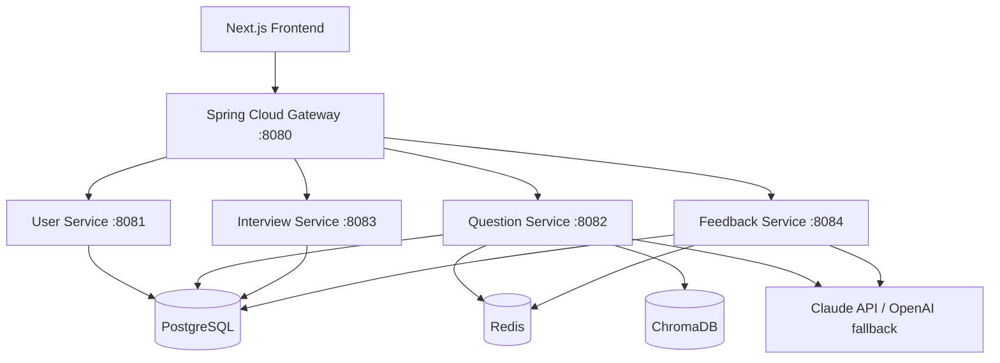

# AI Interview Coach

> JD 분석 기반 질문 생성, AI 모의 면접, SSE 피드백을 제공하는 면접 연습 서비스

AI Interview Coach는 채용공고(JD)를 분석해 예상 질문을 만들고, 사용자가 모의 면접을 진행한 뒤 답변에 대한 피드백과 학습 통계를 확인할 수 있도록 만든 서비스입니다. 백엔드는 5개 Spring Boot 서비스로 나뉘고, 프론트엔드는 Next.js App Router로 구성되어 있습니다.

## 문제와 방향

면접 준비는 JD 분석, 예상 질문 정리, 답변 연습, 피드백, 취약 분야 복습이 따로 흩어지기 쉽습니다. 이 프로젝트는 JD에서 요구 역량을 추출하고, 질문 생성과 면접 세션, 피드백, 통계를 서비스별 책임으로 나눠 면접 준비 흐름을 연결합니다.

## 주요 기능

| 기능 | 설명 |
| --- | --- |
| JD 분석 | 채용공고 텍스트에서 핵심 역량과 기술 스택 추출 |
| 질문 생성 | JD와 직무 유형을 바탕으로 맞춤 면접 질문 생성 |
| 모의 면접 | 타이머, 일시정지, 재개를 포함한 면접 세션 |
| 실시간 피드백 | SSE 기반 답변 피드백 스트리밍 |
| 꼬리 질문 | 답변 보완이 필요한 경우 후속 질문 생성 |
| 학습 통계 | 카테고리별 정답률, 취약 분야, 일일 활동 기록 |
| 취약 분야 반영 | 낮은 정답률 카테고리를 질문 생성에 우선 반영 |

## 아키텍처


```mermaid
flowchart TB
    Web[Next.js Frontend] --> GW[Spring Cloud Gateway :8080]
    GW --> US[User Service :8081]
    GW --> QS[Question Service :8082]
    GW --> IS[Interview Service :8083]
    GW --> FS[Feedback Service :8084]
    US --> PG[(PostgreSQL)]
    QS --> PG
    IS --> PG
    FS --> PG
    QS --> RD[(Redis)]
    FS --> RD
    QS --> CH[(ChromaDB)]
    QS --> LLM[Claude API / OpenAI fallback]
    FS --> LLM
```

## 기술 스택

| 영역 | 기술 |
| --- | --- |
| Backend | Java 21, Spring Boot 3.2, Spring Security, JWT, Spring Data JPA, Spring Cloud Gateway |
| AI / RAG | LangChain4j, Claude API, OpenAI fallback, ChromaDB, AllMiniLmL6V2 |
| Data | PostgreSQL 16, Redis 7 |
| Frontend | Next.js 14, React 18, TypeScript, Tailwind CSS, Zustand, TanStack Query |
| Testing | JUnit 5, Mockito, Vitest, Testing Library, k6 |
| Infra | Docker Compose, Kubernetes Kustomize, GitHub Actions |
| Monitoring | Actuator, Prometheus, Grafana, InfluxDB |

## 서비스 구성

```text
backend/
├─ gateway/              # API Gateway, JWT 검증, 라우팅
├─ user-service/         # 회원가입, 로그인, JWT 발급
├─ question-service/     # JD 분석, 질문 생성, RAG, Redis 캐싱
├─ interview-service/    # 면접 세션, 답변, 검색, 일시정지/재개
└─ feedback-service/     # 답변 평가, SSE 스트리밍, 통계
```

각 서비스는 `domain`, `application`, `infrastructure`, `presentation` 계층으로 나뉘는 Clean Architecture 스타일을 따릅니다.

## 로컬 실행

### 필수 환경

- Java 21+
- Docker & Docker Compose
- Node.js / npm
- Claude API Key 또는 OpenAI API Key

### Docker Compose

```bash
cd infra/docker
cp .env.example .env
docker-compose up -d --build
```

기본 접속 주소:

- Frontend: `http://localhost:3000`
- API Gateway: `http://localhost:8080`
- PostgreSQL: `localhost:5432`
- Redis: `localhost:6379`
- ChromaDB: `localhost:8000`

### 개발 모드

```bash
# 1. 인프라
cd infra/docker
docker-compose up -d postgres redis chromadb

# 2. 백엔드
cd ../../backend
./gradlew build
./gradlew :gateway:bootRun
./gradlew :user-service:bootRun
./gradlew :question-service:bootRun
./gradlew :interview-service:bootRun
./gradlew :feedback-service:bootRun

# 3. 프론트엔드
cd ../frontend/web
npm install
npm run dev
```

## 테스트와 성능 검증

```bash
cd backend
./gradlew test
```

```bash
cd frontend/web
npm run test:run
```

성능 테스트와 모니터링 문서는 `performance/`와 `docs/performance/` 아래에 정리되어 있습니다.

## 성능 개선 기록

저장소에는 다음 최적화 기록이 포함되어 있습니다.

- N+1 쿼리 개선: 면접 목록 조회 SQL `11 → 1`
- 인덱스 추가: 면접, QnA, 통계, 일일 활동 조회 개선
- 통계 업데이트 비관적 락: 동시 답변 제출 시 정합성 보장
- Redis 캐싱: JD 목록과 상세 조회 캐싱
- SSE 전용 스레드 풀: 피드백 스트리밍 타임아웃 완화
- SseEmitter TTL 정리: 장시간 실행 시 메모리 누수 방지
- JVM 힙과 ZGC 튜닝: 서비스별 런타임 옵션 분리

상세 내용은 [docs/performance/TUNING.md](docs/performance/TUNING.md)에서 확인할 수 있습니다.

## 참고 사항

- LLM API 키가 없으면 질문 생성과 피드백 기능은 제한됩니다.
- `performance-report/`에는 자동 생성된 성능 리포트가 포함되어 있습니다.
- 배포 인프라와 모니터링 구성은 코드와 문서 기준으로 제공되며, 실제 운영 상태를 보장하는 문서는 아닙니다.

## 라이선스

MIT License
